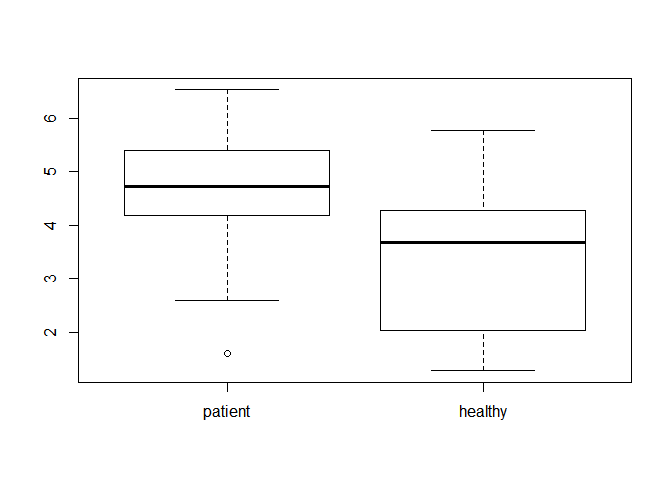
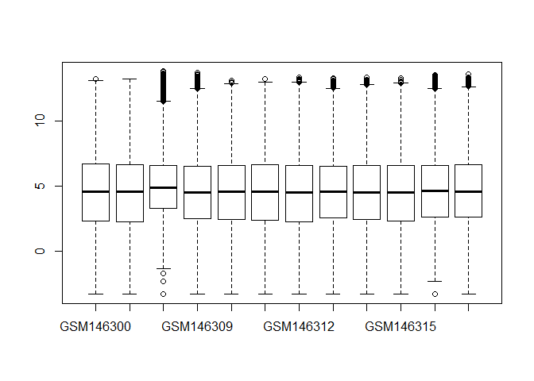
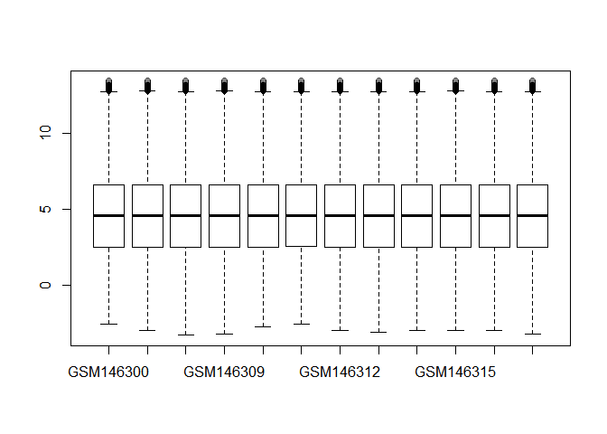
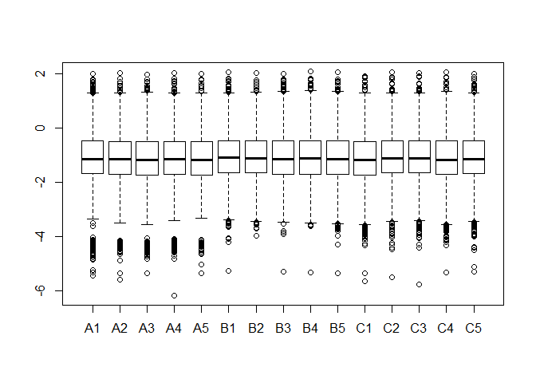
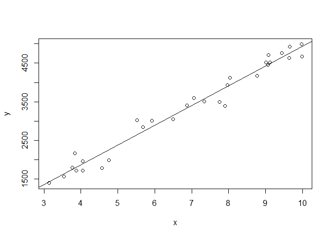
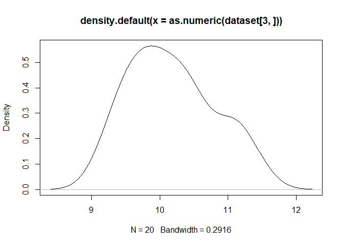
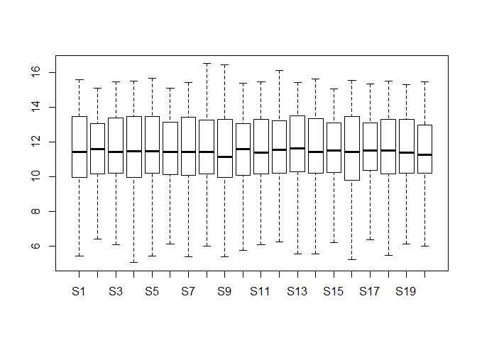
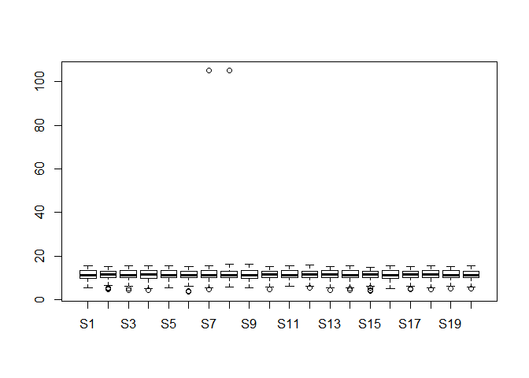
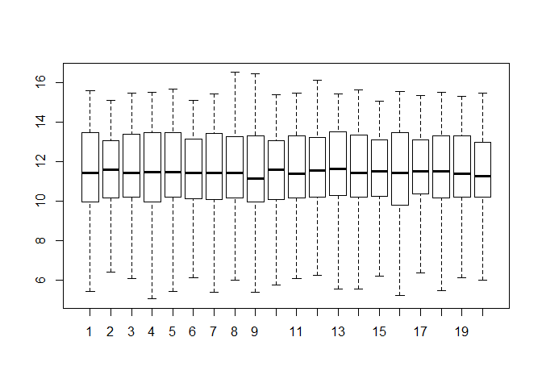

# Preface

对生物统计学复习过程做一个笔记，主要以2015年至2018年考试真题为主，并没有写很多描述性的结论，考试的时候大家酌情添加吧。

按考试的年份排序的，比如2018年是2017级考的试题，但是实在没找到2018年真题，根据数据和代码推的试题。2017年和2015年的题目都较为完整，2016年部分题目找不到。其实总体来看之前考试重复率很高，很多也在平时作业中。今年提高难度不知道是不是“狼来了”的套路，掌握好真题和平时作业，考试应该问题不大。

感谢之前的师兄师姐整理的资料，以及上科大同学的数据和代码。

这份资料中肯定有错误和不详尽的地方，欢迎大家指正和补充。

# 2018 final exam

## Question 2 : Acute Keshan disease

Researchers want to analyze the symptoms of Acute Keshan disease in a place. The result of phosphorus content (mg%) in patients and healthy people is shown in “keshan_disease.txt”，in which column 1 represents phosphorus content of patients and column 2 represents that of healthy people. We want to know if the phosphorus contents (mg%) in patients and healthy people are significantly different. (Describe the steps, give the R code and results calculated with R，本题共25分）

(1) Before doing any test, please use some descriptive statistical methods to describe the difference of the data from two groups . For example, you can calculate the sample mean of the data, and draw two boxplots to show the difference of the data with R. (10分）


```r
K_d_data<-read.table('./data/Keshan_disease.txt',header = T)
head(K_d_data)
```

```
##   patient healthy
## 1    2.60    1.67
## 2    3.24    1.98
## 3    3.73    1.98
## 4    3.73    2.33
## 5    4.32    2.34
## 6    4.71    2.50
```

```r
summary(K_d_data)
```

```
##     patient         healthy     
##  Min.   :1.600   Min.   :1.280  
##  1st Qu.:4.228   1st Qu.:2.045  
##  Median :4.730   Median :3.675  
##  Mean   :4.652   Mean   :3.355  
##  3rd Qu.:5.385   3rd Qu.:4.228  
##  Max.   :6.530   Max.   :5.780
```

```r
boxplot(K_d_data)
```

<!-- -->


(2)Assume that both groups are drawn from normal distribution，give the null and alternative hypotheses to test if the mean values of the two groups are different. Note that you should test if the variances of the two groups are the same or not. (8分)

H0: 两样本均值没有差异

H1: 两样本均值有差异


```r
#F检验-方差齐性检验，默认双尾，若题目问方差:A比B大或A比B小则用单尾"greater" or "less"
var.test(K_d_data$patient,K_d_data$healthy,alternative = 'two.sided')
```

```
## 
## 	F test to compare two variances
## 
## data:  K_d_data$patient and K_d_data$healthy
## F = 0.664, num df = 39, denom df = 39, p-value = 0.2055
## alternative hypothesis: true ratio of variances is not equal to 1
## 95 percent confidence interval:
##  0.3511884 1.2554349
## sample estimates:
## ratio of variances 
##          0.6639987
```
p-value = 0.2055> 0.05 所以接受原假设，方差相等。


```r
t.test(K_d_data$patient,K_d_data$healthy,var.equal = T,alternative = 'two.sided')
```

```
## 
## 	Two Sample t-test
## 
## data:  K_d_data$patient and K_d_data$healthy
## t = 4.8947, df = 78, p-value = 5.2e-06
## alternative hypothesis: true difference in means is not equal to 0
## 95 percent confidence interval:
##  0.7690202 1.8234798
## sample estimates:
## mean of x mean of y 
##   4.65150   3.35525
```
P<0.05,拒绝原假设，接受备择假设，两样本均值之间有差异。

(3)If we don’t give the assumption 'both groups are drawn from normal distribution', use non-parametrical method to do the test again. Hint: wilcoxon rank sum test.。（7分）

```r
wilcox.test(K_d_data$patient,K_d_data$healthy,paired = F,exact = F)
```

```
## 
## 	Wilcoxon rank sum test with continuity correction
## 
## data:  K_d_data$patient and K_d_data$healthy
## W = 1252.5, p-value = 1.358e-05
## alternative hypothesis: true location shift is not equal to 0
```

结论：p-value = 1.358e-05，拒绝原假设，接受备择假设，两样本均值之间有差异。

## Question 3 : CD38 expression

一．CD38 expression is an important prognostic marker in CLL with high levels of CD38 associated with shorter overall survival. In this study, we used gene expression profiling and protein analysis of highly purified cell-sorted CD38+ and CD38- chronic lymphocytic leukemia cells to elucidate a molecular basis for the association between CD38 expression and inferior clinical outcome.

Paired CD38+ and CD38- CLL cells derived from the same patient were used to perform the analysis.

Data: GDS2676.txt GDS2676_sample.txt

Please answer the following questions:

1.	Read in data and do normalization. Draw a boxplot using all samples before and after normalization. (Hint: limma package, function ”normalizeQuantiles”)

To install this package, start R (version "3.6") and enter:

if (!requireNamespace("BiocManager", quietly = TRUE))

  install.packages("BiocManager")
    
BiocManager::install("limma")

>注意以上代码版本需要3.6版本的R，如果提示版本错误而你不想更新R版本的话，可以去官网寻找旧版本R中limma的安装方法。

或者更新R版本的方法：

install.packages("installr")

library(installr)

updateR()

>注意installr最好在R GUI里面安装，Rstudio里安装installr再更新R据说可能遇到bug（没试过不知道真假），如果遇到连不上服务器，原因可能是R设置的镜像不在国内，这里以中科大的开源镜像为例，cran_mirror参数也是CRAN在国内的镜像。

updateR(fast=TRUE,cran_mirror="https://mirrors.ustc.edu.cn/CRAN/") 


```r
GDS2676<-read.table("./data/GDS2676.txt",header = T)
boxplot(GDS2676)
```

<!-- -->

```r
library(limma)
GDS2676.norm<-normalizeQuantiles(GDS2676)
boxplot(GDS2676.norm)
```

<!-- -->

>解释一下基因数据标准化：对基因芯片数据的标准化处理，主要目的是消除由于实验技术所导致的表达量(Intensity) 的变化，并且使各个样本(sample)和平行实验的数据处于相同的水平，从而使我们可以得到 具有生物学意义的基因表达量的变化。

>有人觉得这两个箱线图好像没啥差别，仔细看还是有差别的。标准化主要目的是消除变化，注意和离群点检测有区别，具体不展开了，大家用limma包做标准化即可。


2.	Find differentially expressed genes (down-regulated, CD38- < CD38+) between CD38+ and CD38- disease samples, and provide top 20 down-regulated genes. (Hint: n is small, so please use non-parameter test)


```r
p.value<-apply(GDS2676.norm,1,function(x)wilcox.test(x[seq(1,11,2)],x[seq(2,12,2)],paired = T,alternative ="less",exact = F)$p.value)
sum(p.value<0.05)
```

```
## [1] 617
```

```r
head(p.value)
```

```
##       DDR1       RFC2      HSPA6       PAX8     GUCA1A       UBA7 
## 0.85274630 0.04674624 0.20083908 0.26468405 0.50000000 0.79916092
```

```r
downregulatedgenes_all<-row.names(GDS2676.norm)[p.value<0.05]
order_p.value<-data.frame(sort(p.value))
order_names<-rownames(order_p.value)[1:20]
order_names
```

```
##  [1] "HNRNPA1"  "HNRNPU"   "CTNNA1"   "DSTN"     "RAB6A"    "RRBP1"   
##  [7] "PLS3"     "CST3"     "ID2"      "DLG5"     "NDUFS3"   "PPP2R5C" 
## [13] "LEPROT"   "DHRS3"    "H2AFV"    "SERPINA1" "SLC16A3"  "LOXL2"   
## [19] "PPM1F"    "CCNA2"
```

>seq(1,11,2)作用是生成一个1到11，间隔为2的序列。有人问我这个为什么是配对的，还有人问我这里面哪个是CD38+哪个是CD38-,其实这个看GDS2676_sample.txt就行,里面有介绍。


```r
readLines(file("./data/GDS2676_sample.txt"))
```

```
##  [1] "#e.g. \"CLL#1 CD38- sub-clones\" and \"CLL#1 CD38+ sub-clones\" are paired"
##  [2] "GSM146300\tCLL#1 CD38- sub-clones"                                         
##  [3] "GSM146307\tCLL#1 CD38+ sub-clones"                                         
##  [4] "GSM146308\tCLL#2 CD38- sub-clones"                                         
##  [5] "GSM146309\tCLL#2 CD38+ sub-clones"                                         
##  [6] "GSM146310\tCLL#3 CD38- sub-clones"                                         
##  [7] "GSM146311\tCLL#3 CD38+ sub-clones"                                         
##  [8] "GSM146312\tCLL#4 CD38- sub-clones"                                         
##  [9] "GSM146313\tCLL#4 CD38+ sub-clones"                                         
## [10] "GSM146314\tCLL#5 CD38- sub-clones"                                         
## [11] "GSM146315\tCLL#5 CD38+ sub-clones"                                         
## [12] "GSM146334\tCLL#6 CD38- sub-clones"                                         
## [13] "GSM146335\tCLL#6 CD38+ sub-clones"                                         
## [14] ""
```


3.  Usually you are interested in the function indicated by differentially expressed genes, for which GO enrichment is a widely used method. In order to find whether the differentially expression genes (downregulated, p<=0.05) are enriched in “leukocyte activation during immune response” (GO term), please show a conclusive result using fisher exact test. Known genes annotated with this GO are listed in “GO_2_2.txt”


```r
GO<-read.table("./data/GO_2_2.txt",row.names=1)
GO.name<-row.names(GO)
N.total<-nrow(GDS2676.norm);N.total
```

```
## [1] 14082
```

```r
DEGs.p.value<-p.value[p.value<0.05]
DEGs.name<-names(DEGs.p.value)
noDEGs.p.values<-p.value[p.value>=0.05]
noDEGs.name<-names(noDEGs.p.values)
#既有差异表达且在GO表中(列联表左上角)
N1<-length(intersect(DEGs.name,GO.name));N1
```

```
## [1] 10
```

```r
#没有差异表达但在GO表中(列联表右上角)
N2<-length(intersect(noDEGs.name,GO.name));N2
```

```
## [1] 170
```

```r
#有差异表达但不在GO表中(列联表左下角)
N3<-length(DEGs.name)-N1;N3
```

```
## [1] 607
```

```r
#既无差异表达且不在GO表中（列联表右下角）
N4<-N.total-N1-N2-N3;N4
```

```
## [1] 13295
```

```r
counts<-matrix(data=c(N1,N2,N3,N4),nrow=2,byrow=T,dimnames=list(c("in GO","no in GO"),c("DEGs","noDEGs")));counts
```

```
##          DEGs noDEGs
## in GO      10    170
## no in GO  607  13295
```

```r
fisher.test(counts)
```

```
## 
## 	Fisher's Exact Test for Count Data
## 
## data:  counts
## p-value = 0.4593
## alternative hypothesis: true odds ratio is not equal to 1
## 95 percent confidence interval:
##  0.6036833 2.4446923
## sample estimates:
## odds ratio 
##   1.288372
```
p-value = 0.4593p-value = 0.4593<0.05，不显著富集。

>之前有人说这题其实很不严谨，多重假设检验的结果没校正就直接用了，而且 GO 的 193 个基因中，有 13 个是 GDS2676.txt 中的基因所没有的。既然题目标准是0.05，大家还是按题目要求做吧，自己实际分析基因的时候注意多重校正。多重校正怎么做可以看看2018年或2017年的第五题。

## Question 4 : Drivers

五、数据文件“Drivers.csv”为对45名司机的调查结果，其中四个变量的含义为：

1）x1：表示视力状况，它是一个分类变量，1表示好，0表示有问题；

2）x2：年龄，数值型；

3）x3：驾车教育，它也是一个分类变量，1表示参加过驾车教育，0表示没有；

4）y：一个分类型输出变量，表示去年是否出过事故，1表示出过事故，0表示没有；

问题：

（1）请在R语言中调用logistic回归函数，计算视力状况、年龄、驾车教育与是否发生事故的logistic回归模型，并以“odds=……”的形式写出回归公式。（10分）


```r
drivers<-read.csv("./data/Drivers.csv",header = T,sep = ",")
fit.full<-glm(y~x1+x2+x3, data=drivers, family=binomial)
summary(fit.full)
```

```
## 
## Call:
## glm(formula = y ~ x1 + x2 + x3, family = binomial, data = drivers)
## 
## Deviance Residuals: 
##     Min       1Q   Median       3Q      Max  
## -1.5636  -0.9131  -0.7892   0.9637   1.6000  
## 
## Coefficients:
##              Estimate Std. Error z value Pr(>|z|)  
## (Intercept)  0.597610   0.894831   0.668   0.5042  
## x1          -1.496084   0.704861  -2.123   0.0338 *
## x2          -0.001595   0.016758  -0.095   0.9242  
## x3           0.315865   0.701093   0.451   0.6523  
## ---
## Signif. codes:  0 '***' 0.001 '**' 0.01 '*' 0.05 '.' 0.1 ' ' 1
## 
## (Dispersion parameter for binomial family taken to be 1)
## 
##     Null deviance: 62.183  on 44  degrees of freedom
## Residual deviance: 57.026  on 41  degrees of freedom
## AIC: 65.026
## 
## Number of Fisher Scoring iterations: 4
```

回归公式为：$$odds = exp(0.597610-1.496084x_{1}-0.001595x_{2}+0.315865x_{3})$$
（2）指出（1）得到的模型中哪些因素对是否发生事故有显著性影响。如果存在对是否发生事故没有显著性影响的因素，请去除这些因素后重新计算logistic回归模型，并以“p=……”的形式写出回归公式。（20分）

切记要写H0,HA 文字分析及结论


```r
#Q2 分析Q1的结果 去掉没有显著性影响的因素并重新拟合
#去掉x2,x3
fit.full_re<-glm(y~x1,data = drivers,family = binomial)
summary(fit.full_re)
```

```
## 
## Call:
## glm(formula = y ~ x1, family = binomial, data = drivers)
## 
## Deviance Residuals: 
##     Min       1Q   Median       3Q      Max  
## -1.4490  -0.8782  -0.8782   0.9282   1.5096  
## 
## Coefficients:
##             Estimate Std. Error z value Pr(>|z|)  
## (Intercept)   0.6190     0.4688   1.320   0.1867  
## x1           -1.3728     0.6353  -2.161   0.0307 *
## ---
## Signif. codes:  0 '***' 0.001 '**' 0.01 '*' 0.05 '.' 0.1 ' ' 1
## 
## (Dispersion parameter for binomial family taken to be 1)
## 
##     Null deviance: 62.183  on 44  degrees of freedom
## Residual deviance: 57.241  on 43  degrees of freedom
## AIC: 61.241
## 
## Number of Fisher Scoring iterations: 4
```

```r
#p=exp(0.6190-1.3728x1)
#anova对比两个模型
anova(fit.full,fit.full_re,test = "Chisq")
```

```
## Analysis of Deviance Table
## 
## Model 1: y ~ x1 + x2 + x3
## Model 2: y ~ x1
##   Resid. Df Resid. Dev Df Deviance Pr(>Chi)
## 1        41     57.026                     
## 2        43     57.241 -2 -0.21572   0.8978
```
没有差异，拟合程度一致

拟合公式为：

$$p=\frac{exp(0.6190-1.3728x_{1})}{1+exp(0.6190-1.3728x_{1})}$$


（3）A是一名参加过驾车教育，但视力有问题的50岁老司机；B是一名没有参加过驾车教育，但视力良好的20岁新手。现在A、B都想在某保险公司投保，但按公司规定，被保险人必须满足“明年出事故的概率不高于40%”的条件才能予以承保。请预测A、B两者明年出事故的概率，并告诉保险公司谁可以投保。（20分）


```r
# Q3 用拟合的模型来预测
testdata<-data.frame(x1=c(0,1))
testdata_p<-predict(fit.full_re,testdata,type="response")
testdata_p
```

```
##    1    2 
## 0.65 0.32
```

所以 A、B 两者明年出事故的概率分别为 0.65 和 0.32。
因只有 B 明年出事故的概率不高于 40%，故只有 B 可以投保。

>注意评分标准认为用（1）的模型计算不得分，但若能够正确调用predict()的可得5分。虽然两个模型没有差异，但是其他指标对事故概率其实没有影响，所以应该用（2）的模型计算概率。（个人理解）

## Question 5 : protein

文件protein.csv是15 只小鼠随机分为3组并且分别经历A（安慰剂）、B药物、C药物处理后（见下表）某个组织的蛋白质组数据，请做一下分析。

（1）对数据进行标准化（每列除以各自均值），每个数取其底为 10 的对数后绘制箱线图。（5 分）


```r
#protein
protein<-read.csv("./data/protein.csv",sep = ",",header = T,row.names = 1)
#Q1 标准化，绘制箱线图
protein_norm<-apply(protein,2, function(x){x/mean(x)})
boxplot(log10(protein_norm))
```

<!-- -->

（2）首先对原始数据进行标准化（每列除以各自均值），再用方差分析(不做正态性以及方差齐性检验)筛选差异表达基因（p-value <0.05）并显示其数量。（10 分）

```r
#Q2 方差分析筛选差异表达基因（p.value<0.05）并显示数量
f.row<-factor(rep(c("A","B","C"),each=5))#重新命名factor
anova.p<-apply(protein_norm,1,function(x){x<-as.numeric(x);anova(lm(x~f.row))$`Pr(>F)`[1]})
protein_new<-data.frame(protein_norm,anova.p)
protein_screen<-protein_new[which(anova.p<0.05),]
dim(protein_screen)
```

```
## [1] 1048   16
```

（3）用 p.adjust(data,method= "bonferroni")函数对（2）题p值进行校正，然后再筛选异表达基因（p-value<0.05）并显示其数量。（5 分）

```r
# Q3
anova.p.adj=p.adjust(anova.p,method = "bonferroni")
protein_adjust<-data.frame(protein_new,anova.p.adj)
protein_adjust_screen<-protein_adjust[which(anova.p.adj<0.05),]
dim(protein_adjust_screen)
```

```
## [1] 203  17
```


# 2017 final exam

2016级第二学期《生物统计学》期末考试试题

2017年6月16日1:30-4:30

## Question 1 : white balls

There are 3 white balls and 8 black balls in a pocket. （本题共20分）

1. If we take out a ball **without replacement** every time, what’s the probability that there is only one white ball after 4 balls are taken out? (5分）

> = 4 x 8 x 7 x 6 x 3 /(11 x 10 x 9 x 8) 

2. If we take out a ball **with replacement** every time, what’s the probability that there is only one white ball after 4 balls are taken out? (5分）

> = 4 x 8 x 8 x 8 x 3/(11 x 11 x 11 x 11) 

3. If we take out a ball **without replacement** every time, what’s the probability that the colors of the taken balls are black, white, white, and black in sequence after 4 balls are taken out? (5分）

> = 8 x 3 x 2 x 7/(11 x 10 x 9 x 8)

4. If we take out a ball **with replacement** every time, what’s the probability that the colors of the taken balls are black, white, white, and black in sequence after 4 balls are taken out? (5分）

> = 8 x 3 x 3 x 8 /(11 x 11 x 11 x 11) 

> 注意放回与不放回的区别

## Question 2

同2018年第二题。

## Question 3 : anemia.txt
Data given in dataset “anemia.txt”are the aplastic anemia data of 30 patients. We want to dig in the relationship between reticutyte and lymphocyte using linear regression model. Note that lymphocyte is the response variable. (本题共20分)

Note that you should give the formulas for calculation of the statistical values and the correlation coefficient. Hint:_the calculations can be performed with R.

(1)Calculate the statistical values Lxx, Lyy, and Lxy. (6分)
$$L_{xx}=\sum_{i=1}^{n}\left(x_{i}-\overline{x}\right)^{2}=\sum_{i=1}^{n} x_{i}^{2}-\left(\sum_{i=1}^{n} x_{i}\right)^{2} / n$$
$$L_{yy}=\sum_{i=1}^{n}\left(y_{i}-\overline{y}\right)^{2}=\sum_{i=1}^{n} y_{i}^{2}-\left(\sum_{i=1}^{n} y_{i}\right)^{2} / n$$
$$L_{xy}=\sum_{i=1}^{n}\left(x_{i}-\overline{x}\right)\left(y_{i}-\overline{y}\right)=\sum_{i=1}^{n} x_{i} y_{i}-\left(\sum_{i=1}^{n} x_{i}\right)\left(\sum_{i=1}^{n} y_{i}\right) / n$$

$$\beta=L_{xy}/L_{xx}$$


```r
anemia_data<-read.table('./data/anemia.txt',header = T,sep = "")
head(anemia_data)
```

```
##   reticulyte lymphocyte
## 1   9.118583   4524.095
## 2   3.833464   2161.239
## 3   7.752760   3492.992
## 4   7.053196   3600.464
## 5   9.985216   4669.775
## 6   8.765333   4178.618
```

```r
x<-anemia_data$reticulyte
y<-anemia_data$lymphocyte
Lxx<-sum(x^2)-(sum(x))^2/length(x);Lxx
```

```
## [1] 151.8913
```

```r
Lyy<-sum(y^2)-(sum(y))^2/length(y);Lyy
```

```
## [1] 40906974
```

```r
Lxy<-sum(x*y)-(sum(x)*sum(y))/length(y);Lxy
```

```
## [1] 77690.2
```

```r
Lxy<-sum(x*y)-(sum(x)*sum(y))/length(x);Lxy
```

```
## [1] 77690.2
```

(2)Give the linear model that fits the data as well as the p-value with R. （7分）


```r
myfit<-lm(y~x,data=anemia_data)
plot(y~x)
abline(myfit)
```

<!-- -->

```r
summary(myfit)
```

```
## 
## Call:
## lm(formula = y ~ x, data = anemia_data)
## 
## Residuals:
##     Min      1Q  Median      3Q     Max 
## -467.91 -113.60   41.44  115.93  384.02 
## 
## Coefficients:
##             Estimate Std. Error t value Pr(>|t|)    
## (Intercept)  -183.54     119.76  -1.533    0.137    
## x             511.49      16.58  30.844   <2e-16 ***
## ---
## Signif. codes:  0 '***' 0.001 '**' 0.01 '*' 0.05 '.' 0.1 ' ' 1
## 
## Residual standard error: 204.4 on 28 degrees of freedom
## Multiple R-squared:  0.9714,	Adjusted R-squared:  0.9704 
## F-statistic: 951.3 on 1 and 28 DF,  p-value: < 2.2e-16
```

(3)Calculate the correlation coefficient based on the statistical values. （7分）

$$r=\frac{\sum(x-\overline{x})(y-\overline{y})}{\sqrt{\sum(x-\overline{x})^{2} \sum(y-\overline{y})^{2}}}$$


```r
cor(x,y)
```

```
## [1] 0.9856011
```

```r
cor.test(x,y)
```

```
## 
## 	Pearson's product-moment correlation
## 
## data:  x and y
## t = 30.844, df = 28, p-value < 2.2e-16
## alternative hypothesis: true correlation is not equal to 0
## 95 percent confidence interval:
##  0.9696296 0.9932023
## sample estimates:
##       cor 
## 0.9856011
```

## Question 4 : lung cancer

A certain protein A was investigated as predictor of lung cancer patients priognostic. They gathered data of patients and healthy people from three hospitals, including the expression level of protein A together with the expression level of β-actin-a house keeping gene, their survival time after diagnosis and others. The data can be found in “lung_cancer.txt”. See “instruction.pdf” for data details (R code required).  (本题共15分)

Status: 0‐healthy; 1‐disease

Abnormal: 0-expresion of protein A is normal;1-abnormal

Β-actin: an inner control, may reflect some characteristics of experiment

Hospital:1-data from hospital Alpha; 2-from hospital Beta; 3-from hospital Gamma

Gender: 0-female; 1-male Smoke: 0-nonsmoker; 1-smoker Drink: 0-do not drink or drink a little; 1‐drinker

Survival_status: only patients are actually observed, 0-censored; 1‐death observed

(1)Conduct one-way ANOVA to examine whether the source of data could have impact on the expression level of protein A. Hint: check the homogeneity of variances before ANOVA(8分)

H0:服从正态分布

H1:不服从正态分布


```r
lung_cancer_data<-read.table('./data/lung_cancer.txt',header = T)
head(lung_cancer_data)
```

```
##   status  exp_A abnormal exp_actin hospital gender smoke drink age
## 1      0 105.68        1    212.13        1      0     1     0  51
## 2      0  74.33        0    208.44        1      1     1     0  53
## 3      0  57.71        0    244.47        1      1     0     0  55
## 4      0  94.22        0    181.19        1      1     0     0  50
## 5      0  49.19        0    187.21        1      0     0     0  60
## 6      0  76.93        0    188.44        1      1     0     1  47
##   survival survival_status
## 1        0               0
## 2        0               0
## 3        0               0
## 4        0               0
## 5        0               0
## 6        0               0
```

```r
shapiro.test(lung_cancer_data$exp_A[lung_cancer_data$hospital=='1'])
```

```
## 
## 	Shapiro-Wilk normality test
## 
## data:  lung_cancer_data$exp_A[lung_cancer_data$hospital == "1"]
## W = 0.99125, p-value = 0.7648
```

```r
shapiro.test(lung_cancer_data$exp_A[lung_cancer_data$hospital=='2'])
```

```
## 
## 	Shapiro-Wilk normality test
## 
## data:  lung_cancer_data$exp_A[lung_cancer_data$hospital == "2"]
## W = 0.96509, p-value = 0.1452
```

```r
shapiro.test(lung_cancer_data$exp_A[lung_cancer_data$hospital=='3'])
```

```
## 
## 	Shapiro-Wilk normality test
## 
## data:  lung_cancer_data$exp_A[lung_cancer_data$hospital == "3"]
## W = 0.97516, p-value = 0.3702
```
结论：p-value均大于0.05，接受原假设，均服从正态分布。

H0:方差齐次

H1:方差不齐次

```r
bartlett.test(lung_cancer_data$exp_A~as.factor(lung_cancer_data$hospital),data = lung_cancer_data)
```

```
## 
## 	Bartlett test of homogeneity of variances
## 
## data:  lung_cancer_data$exp_A by as.factor(lung_cancer_data$hospital)
## Bartlett's K-squared = 1.5481, df = 2, p-value = 0.4611
```
结论：p-value大于0.05，接受原假设，方差齐次。

因此可以用ANOVA分析

H0:不同数据来源对蛋白A的表达水平无影响。

H1:不同数据来源对蛋白A的表达水平有影响。


```r
ff<-aov(lung_cancer_data$exp_A~as.factor(lung_cancer_data$hospital),data = lung_cancer_data)
summary(ff)
```

```
##                                       Df Sum Sq Mean Sq F value  Pr(>F)
## as.factor(lung_cancer_data$hospital)   2  44670   22335   31.65 1.2e-12
## Residuals                            197 139010     706                
##                                         
## as.factor(lung_cancer_data$hospital) ***
## Residuals                               
## ---
## Signif. codes:  0 '***' 0.001 '**' 0.01 '*' 0.05 '.' 0.1 ' ' 1
```
结论：P-value = 1.2e-12

因此接受备择假设，不同数据来源对蛋白A的表达水平有影响


```r
TukeyHSD(ff)#查看交互作用
```

```
##   Tukey multiple comparisons of means
##     95% family-wise confidence level
## 
## Fit: aov(formula = lung_cancer_data$exp_A ~ as.factor(lung_cancer_data$hospital), data = lung_cancer_data)
## 
## $`as.factor(lung_cancer_data$hospital)`
##         diff      lwr      upr     p adj
## 2-1 -33.3103 -44.1758 -22.4448 0.0000000
## 3-1 -25.4179 -36.2834 -14.5524 0.0000003
## 3-2   7.8924  -4.6540  20.4388 0.3000431
```
结论：1号数据来源与2,3号数据来源差别都较大，很可能存在问题。

(2)Some researchers acclaimed that whether the expression level of protein A is abnormal do not have any relation with status. Based on data from hospital Alpha, could we refuse the conclusion? Hint: With status as response, the logistic regression abnormal do not have any relation with status. Based on data from hospital Alpha, could we refuse the conclusion? Hint: With status as response, the logistic regression can be used to investigate the correlation. (7分)

H0:不同status对蛋白A的表达水平无影响。

H1:不同status对蛋白A的表达水平有影响。


```r
new_data<-subset(lung_cancer_data,lung_cancer_data$hospital== 1)
length(new_data)
```

```
## [1] 11
```

```r
glm_fit<-glm(new_data$status~new_data$abnormal,data = new_data,family=binomial())
summary(glm_fit)
```

```
## 
## Call:
## glm(formula = new_data$status ~ new_data$abnormal, family = binomial(), 
##     data = new_data)
## 
## Deviance Residuals: 
##     Min       1Q   Median       3Q      Max  
## -1.7847  -1.2403   0.6744   0.6744   1.1158  
## 
## Coefficients:
##                   Estimate Std. Error z value Pr(>|z|)   
## (Intercept)         0.1466     0.3132   0.468  0.63971   
## new_data$abnormal   1.2186     0.4502   2.707  0.00679 **
## ---
## Signif. codes:  0 '***' 0.001 '**' 0.01 '*' 0.05 '.' 0.1 ' ' 1
## 
## (Dispersion parameter for binomial family taken to be 1)
## 
##     Null deviance: 123.82  on 99  degrees of freedom
## Residual deviance: 116.22  on 98  degrees of freedom
## AIC: 120.22
## 
## Number of Fisher Scoring iterations: 4
```

## Question 5 : NASH 2017
Nonalcoholic steatohepatitis or NASH is a common liver disease, and was found to be linked to obesity and diabetes, suggesting an important role of adipose tissue in the pathogenesis of NASH. Therefore, the mouse model was used to investigate the interaction between adipose tissue and liver. Wildtype male C57Bl/6 mice were fed low fat food (LFD) or high fat food (HFD) for 21 weeks. The detailed data can be found in GDS4013.txt. Hint: provide the R code and result calculated with R. （本题共20分）

1.Read the data. Check whether there are NAs in the data? If NAs exist, you should deaf with them before next steps. Hint: delete the rows with NAs in data. (5分）

```r
GDS4013_data<-read.table('./data/GDS4013.txt',header = T)

head(GDS4013_data)
```

```
##               LFD    LFD.1    LFD.2    LFD.3    LFD.4    LFD.5    LFD.6
## COPG1    7.756187 7.513726 7.927167 7.742323 7.974731 7.632936 7.419638
## ATP6V0D1 8.968808 9.004967 9.025234 9.139161 9.142125 8.998360 9.097204
## GOLGA7   9.698317 9.798994 9.765514 9.581075 9.776361 9.829636 9.670068
## PSPH     6.897664       NA 6.744140 7.225862 7.343744 6.877918 6.422594
## TRAPPC4  5.406903 5.473714 5.749002 5.416623 5.351018 5.431658 5.606044
## DPM2     6.532734 6.215751 6.520986 6.143827 6.597586 6.731978 6.553594
##             LFD.7    LFD.8    LFD.9      HFD    HFD.1    HFD.2    HFD.3
## COPG1    8.022296 7.649602 7.694316 7.717317 7.721638 7.873688 7.637193
## ATP6V0D1 9.181852 9.127648 9.149562 9.029930 8.948781 9.095943 9.092459
## GOLGA7   9.675262 9.812124 9.637824 9.625283 9.822128 9.700576 9.739647
## PSPH     7.188237 6.819006 6.524627 6.514469 6.949181 7.044664 6.708345
## TRAPPC4  5.401849 5.374199 5.331412 5.439976 5.487543 5.290085 5.485993
## DPM2     6.659309 6.288114 6.561733 6.819006 6.616581 6.349064 6.554808
##             HFD.4    HFD.5    HFD.6    HFD.7
## COPG1    7.570261 7.549871 7.687248 7.603990
## ATP6V0D1 8.981442 9.014060 9.122049 9.000419
## GOLGA7   9.679455 9.790654 9.817816 9.761968
## PSPH     6.413345 6.617198 6.843793 6.467956
## TRAPPC4  5.376865 5.522681 5.430362 5.490806
## DPM2     6.416926 6.562119 6.524627 6.771978
```

```r
table(is.na(GDS4013_data))# 检查缺失值
```

```
## 
##  FALSE   TRUE 
## 481694      4
```

```r
GDS4013_new<-na.omit(GDS4013_data)#去除缺失值

table(is.na(GDS4013_new))#检验去除缺失值的效果
```

```
## 
##  FALSE 
## 481626
```

2.Find differentially expressed genes (DEGs) (up-regulated, HF>LF) between LFD and HFD samples, list the DEGs with adjusted p-values less than 0.05. For expressions of each gene, check the homogeneity of the variances in two groups at first. Hint: FDR should be used to adjust p-values. (15分)

先F检验，再用t检验（若样本数太少则用非参数检验wilcox.test()

```r
p.vartest <- apply(GDS4013_new, 1, function(x)var.test(x[1:10],x[11:18])$p.value) 
GDS4013_new_data <- cbind(GDS4013_new, p.vartest)
# 按题目要求取单尾 x[1:10] < x[11:18],alternative = 'less'
p.value <- apply(GDS4013_new_data, 1, function(x)t.test(x[1:10],x[11:18],alternative = 'less', var.equal = (x[19] >= 0.05))$p.value)
p.fdr <- p.adjust(p.value, "fdr")
sum(p.fdr<0.05)
```

```
## [1] 2
```

```r
sig.p.fdr<-p.fdr[p.fdr<0.05]
names(sort(sig.p.fdr))
```

```
## [1] "SEMA5B"   "BC048403"
```

# 2016 final exam

## Question 1

同2017年第四题

## Question 2

空，资料中没这题。

## Question 3

同2018年第三题

## Question 4

同2018年第二题

## Question 5

空，资料中没这题。

# 2015 final exam

## Question 1

同2018年第三题

## Question 2

同2017年第三题

## Question 3 : microarray

This question needs to use data "datasets.txt", which derives from a microarray dataset investigating gene e ression of certain disease. The data has been processed,and the first row of the data is the sample serial number,namely,S1 - S20, and the first column of the data is the genes (G1- G1OO). The numbers are the expression values of each gene.Please answer the following questions (R code required)

Please draw a density plot (PDF) to investigate the distribution G3 gene expression among 20 samples, and then calculate its minimum, median and variance using certain function in R. ( 10 分) 


```r
dataset <- read.table("./data/datasets.txt",header = T)
dataset <- as.matrix(dataset)
#(1)
plot(density(as.numeric(dataset[3,])))
```

<!-- -->

```r
pdf("fil.pdf")#在工作目录下输出pdf文件
plot(density(as.numeric(dataset[3,])))
dev.off()
```

```
## png 
##   2
```

```r
min(dataset[3,])
```

```
## [1] 9.271463
```

```r
mean(dataset[3,])
```

```
## [1] 10.17452
```

```r
var(dataset[3,])
```

```
## [1] 0.3880644
```

Please draw a boxplot to compare the distribution of all genes expression among 20 different samples. Note that you should check whether there are any outliers in them? If they really exist, please delete them and redo it. (10 分) 


```r
boxplot(dataset)
```

<!-- -->

```r
dataset_re <- dataset
dataset_re[dataset_re > 100] <- NA
boxplot(dataset_re)
```

<!-- -->

可以明显看出离群点，以及删除离群点之后的变化。

离群点检测与处理：

其实数据科学中离群点的问题可以专门讨论，里面涉及到的方法很多，在这里不过多介绍了。有兴趣的同学可以自己检索一下。

在刚才的箱线图中，其实除去上面两个特别离谱的那两个数据外，下面那些点也是离群点。不过这些点离群不严重，又基本每个样本都有,很难说这个是离群点还是误差。不过既然要删除离群值那就删了吧。


```r
# 只是不看离群值的话，画图的时候设置一下就行。
boxplot(dataset,outline=FALSE)
```

<!-- -->

```r
# 非要删除离群值再重新作图也不是不可以。
gene_boxplot <- boxplot(dataset[,1:20])
```

<!-- -->

```r
outlier <- gene_boxplot$out
na.omit(outlier)
```

```
##  [1]   4.911692   5.035624   5.161888   5.426265   4.963474   4.560715
##  [7]   4.364572   3.560715   4.112700 105.000000   4.930737 105.000000
## [13]   4.827819   4.705978   5.545351   4.465974   5.281698   4.336283
## [19]   4.536053   4.213347   5.617651   4.807355   4.981853   5.244126
## [25]   4.590961   4.963474   4.986411
```

```r
boxplot(gene_boxplot$stats)
```

<!-- -->

## Question 4

同2017年第四题

## Question 5 : NASH 2015

>和2017年第五题很类似，可能2017年就是从2015年的题改的。

5. Nonalcoholic steatohepatitis or NASH is a common liver disease, and was found to be linked to obesity and diabetas, suggesting an important role of adipose tissue in the pathogenesis of NASH.Therefore, the mouse model was used to investigate the interaction between adipose tissure and liver.Wildtype male C57B1/6 mice were were fed LFD or HFD for 21 weeks,and the mice were divided into 4 groups based on liver histology and food fed. The detailed data can be found in GDS4013.txt, GDS4013_sample.txt and methylation.txt. (The analysis should be performed in R) 

(l) Read in and normalize the data. Please check whether there is any "NA" in them? If so you will need to deal with them.


```r
GDS43013 <- read.table("./data/GDS4013_2015.txt",header = T)
GDS43013_sample <- read.table("./data/GDS4013_sample.txt",header = F)
methylation <- read.table("./data/methylation.txt",header = F)
#(1)
table(is.na(GDS43013))
```

```
## 
##  FALSE 
## 481698
```

```r
table(is.na(methylation))
```

```
## 
## FALSE 
## 53522
```

```r
# 这里没有缺失值，有缺失值的话用na.omit(GDS43013)即可。
library(limma)
GDS_norm <- normalizeQuantiles(GDS43013) # 数据标准化
```

(2) Find differentially expressed genes (up-regulated, HF>LF) between LF and HF samples, and list the top 20 up-regulated genes.Which statistical test should be used here?


```r
#(2)
t_test <- function(x) {
  x <- unlist(x)
  if (var.test(x[1:10],x[11:18])$p.value < 0.05) {
    t.test(x[1:10],x[11:18],var.equal = F,alternative = "less")$p.value
  }else {
    t.test(x[1:10],x[11:18],var.equal = T,alternative = "less")$p.value
  }
}
GDS43013$pvalue <- apply(GDS43013,1,t_test)
rownames(GDS43013)[order(GDS43013$pvalue)[1:20]]
```

```
##  [1] "SEMA5B"        "BC048403"      "PMPCB"         "CES2E"        
##  [5] "GSTK1"         "SEMA4D"        "LAMB3"         "4921518J05RIK"
##  [9] "HSD17B4"       "PEX13"         "LIAS"          "PSTPIP1"      
## [13] "LOC100504952"  "MTNR1A"        "PARK7"         "CLSTN3"       
## [17] "OCIAD2"        "DEFB35"        "HEXDC"         "FABP2"
```
(3) You have the methylation data in normal state liver tissues fo each gene from another study (methylation.txt). You want to know whether the methylation levels of the differentially expressed genes (DEGs) are different from other genes in normal state. Please randomly choose the same number of genes as that of the 
DEGs, and use t-test to check it.

```r
set.seed(20190614)
# 注意是随机抽样，每个人的结果可能有不同的地方。
deg <- sample(rownames(GDS43013[GDS43013$pvalue < 0.05,]),size = 20)
ndeg <- sample(rownames(GDS43013[GDS43013$pvalue > 0.05,]),size = 20)
deg <- data.frame(name = deg,meth = 
                    methylation$V2[match(deg,methylation$V1)])
ndeg <- data.frame(name = ndeg,meth =
                   methylation$V2[match(ndeg,methylation$V1)])
var.test(deg$meth,ndeg$meth)
```

```
## 
## 	F test to compare two variances
## 
## data:  deg$meth and ndeg$meth
## F = 2.6794, num df = 19, denom df = 19, p-value = 0.03754
## alternative hypothesis: true ratio of variances is not equal to 1
## 95 percent confidence interval:
##  1.060535 6.769346
## sample estimates:
## ratio of variances 
##            2.67939
```

```r
t.test(deg$meth,ndeg$meth,var.equal = var.test(deg$meth,ndeg$meth)$p.value	>=	0.05) #根据方差齐性检验做t-test。
```

```
## 
## 	Welch Two Sample t-test
## 
## data:  deg$meth and ndeg$meth
## t = 2.19, df = 31.448, p-value = 0.03606
## alternative hypothesis: true difference in means is not equal to 0
## 95 percent confidence interval:
##  0.01194761 0.33315141
## sample estimates:
## mean of x mean of y 
## 0.5849530 0.4124035
```


(4) Please provide the power of t-test used in (3). (hint : this is two independent samples, so use pooled variance when you calculate the absolute effect size)


```r
#(4)
pooled.sd <- function(data){
  p <- length(table(data$g))
  n.g <- table(data$g)
  sd.g <- aggregate(data$y,by=list(data$g),sd)[,2]
  sqrt(sum((n.g - 1) * sd.g^2)/(sum(n.g) - p))
}
data <- data.frame(y = c(deg$meth,ndeg$meth),
                   g = c(rep("deg",20),rep("ndeg",20)))
delta <- mean(deg$met) - mean(ndeg$meth) / pooled.sd(data)
power.t.test(n = 20,delta = mean(deg$met) - mean(ndeg$meth),
             sd = pooled.sd(data),
             sig.level = 0.05)
```

```
## 
##      Two-sample t test power calculation 
## 
##               n = 20
##           delta = 0.1725495
##              sd = 0.2491581
##       sig.level = 0.05
##           power = 0.5692488
##     alternative = two.sided
## 
## NOTE: n is number in *each* group
```

pooled variance即合并方差：
$$
S_{c}^{2}=\frac{\left(n_{1}-1\right) S_{1}^{2}+\left(n_{2}-1\right) S_{2}^{2}}{n_{1}+n_{2}-2}
$$

>个人觉得不会考这么复杂的题。
